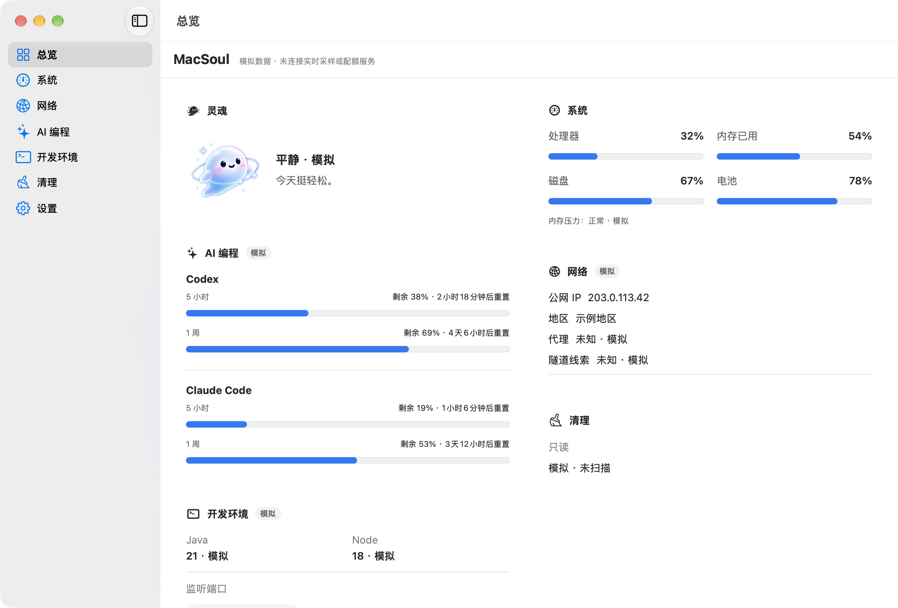
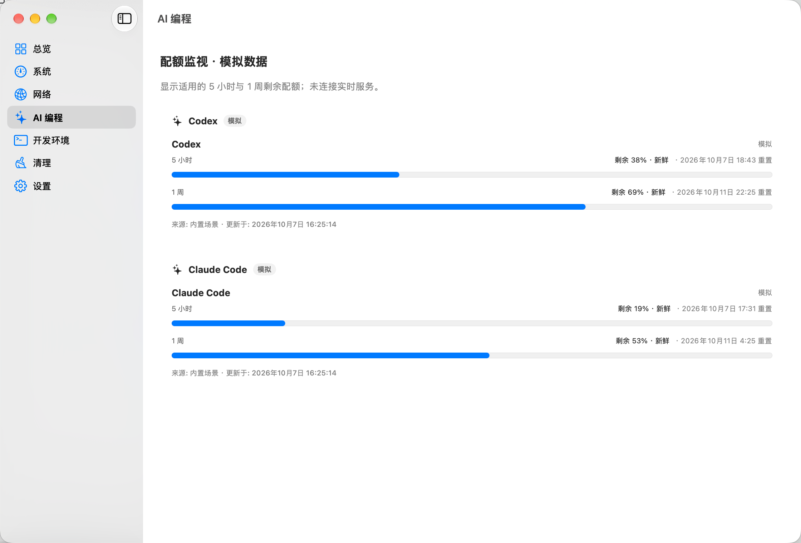
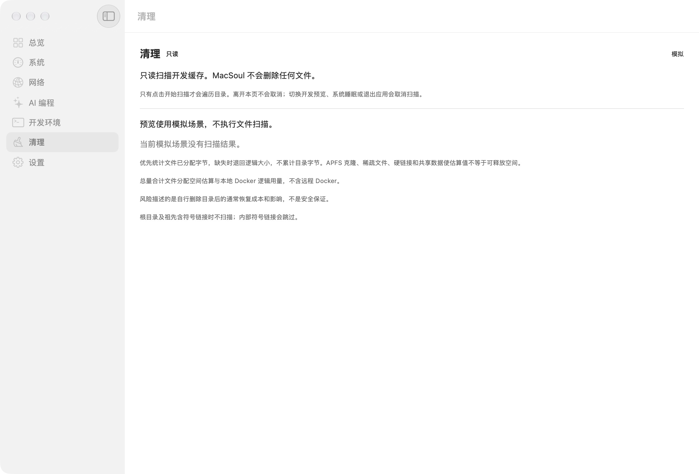
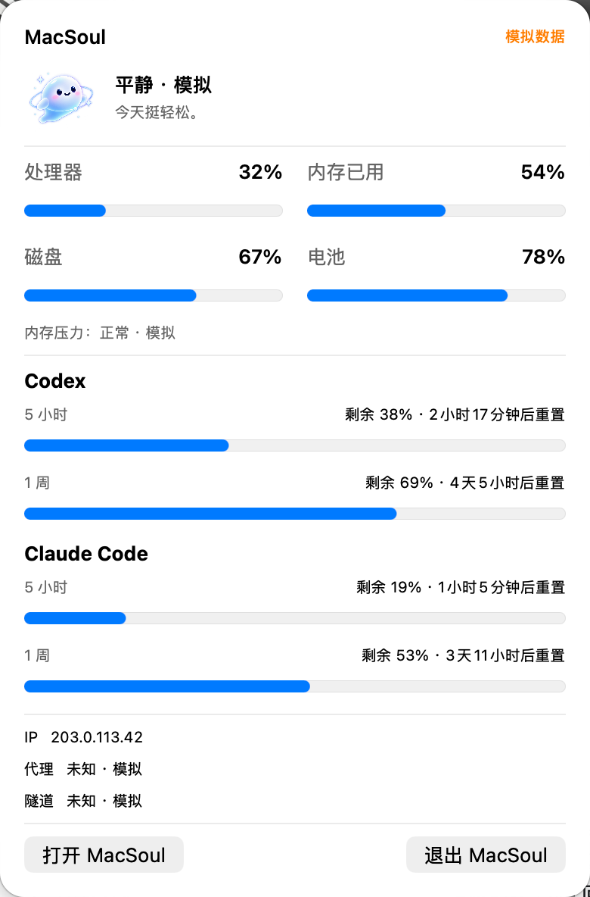

<p align="center">
  
</p>

<h1 align="center">MacSoul</h1>

<p align="center"><strong>A macOS developer companion with a little attitude.</strong><br>Your Mac knows what you're building.</p>

<p align="center">Native SwiftUI · Menu bar · System health · AI quotas · Soul</p>

<p align="center"><a href="README.md">简体中文</a> · English</p>

MacSoul aims to bring system health, AI coding quotas, network information and your local development environment into one native macOS app. A small spirit turns states worth noticing into a short reaction:

> - Sustained CPU overload: “My brain is about to explode.”
> - Critical memory pressure: “My stomach is about to burst.”
> - Recovery: “Phew… finally quiet again.”

**Personality gets your attention. Clear, trustworthy information is the point.**

> **v0.1.0 Unsigned Developer Preview preparation; not publicly released.** Developer Preview uses mock data by default. Live System enables shared System, Network and Dev snapshots and the verified Codex App Server integration. Claude stays unavailable without a verified live quota source. Cleaner scans read-only only on explicit Scan; there is no deletion. Day 2–5 automated and Owner acceptance records are retained. Day 6 is closed within the Owner-approved acceptance boundary; Day 7 local unsigned RC has completed Owner scoped final review. Screenshots and final Live regression PASS; CPU PASS, RSS REVIEW ACCEPTED. PR #10 is merged and main CI passed. This phase prepares precompiled unsigned, unnotarized DMG / ZIP downloads; public release awaits final Owner approval.


> This is early product artwork, **not a current app screenshot or acceptance evidence**. Its VPN status, latency and cleanup buttons are not implemented; the pictured metric layout does not represent the current live UI.

## Current App screenshots

These are real Developer Preview captures of the current candidate with bundled mock data. AI quota and reset-time values are synthetic Developer Preview data. Cleaner shows the not-scanned state; Settings shows the upper section. Screenshot privacy review and Owner screenshot review passed. Concept artwork is not an App screenshot.





*AI Coding — Developer Preview. Quota and reset time are Developer Preview mock data and do not represent a real account.*





Additional view: [Settings, upper section (Developer Preview)](docs/screenshots/v0.1/settings.png).

*Settings — This is an unsigned Developer Preview. Launch at Login is honestly unavailable in this RC; real Login Item registration/unregistration awaits validation in a signed, installed distribution environment.*

## Features and implementation status

| Module | Intended use | Current default branch |
|---|---|---|
| **Soul** | Concise reactions and recovery | Deterministic local rules: sustained CPU thresholds, memory pressure, cooldown/recovery; static artwork, no LLM |
| **System** | CPU, memory, storage, power and developer processes | Native CPU, memory used/total, pressure events, root-volume disk, power-source state, process CPU delta/RSS; natural warning observed, critical not observed |
| **AI quotas** | Applicable Codex / Claude Code windows | Verified Codex CLI 0.160.0 / 0.160.1 / 0.162.0-alpha.2; shared remaining percentages and provider resets; Claude unavailable without verified source |
| **Network** | Egress IP, proxy hints, transport checks | NWPath, independent IPv4/IPv6, App/system proxy context, tunnel hints and anonymous HEAD probes; Region not collected |
| **Dev environment** | Runtime contexts and developer TCP listeners | Java/Node/Python/Go, SDKMAN/NVM/pyenv/goenv, cache/refresh; developer filtering plus full-list disclosure; stop command is copy-only |
| **Dev storage** | Explain estimates and inspect contents | Read-only Xcode/Gradle/Maven/npm/Homebrew Preview/drill-down, local Docker logical usage without VM traversal; no cleanup |


The main window provides detail; the **menu bar is the universal quick-access surface**. A notched display is not required. Notch presentation is outside the current scope.

### Quotas that reflect the available windows

MacSoul is designed to display the windows actually reported for an account, not guess limits from a subscription name. Live and Mock share the same window contract:

| Data | Presentation |
|---|---|
| Week exists and 5h is explicitly not applicable | Show Week in summaries; do not invent a 5h bar |
| Both 5h and Week exist | Show both |
| A valid window reports 0% used | Show 100% remaining; do not treat it as missing |
| Unreported, failed or stale data | Show that state; never turn it into “unlimited” or fresh usage |

Both surfaces consume the same state. The AI module does not manage agent sessions, analyze token costs or automatically select models. It concerns **Codex / Claude Code quotas**, not a combined view of ChatGPT chat limits.

Settings can switch MacSoul between Follow macOS, Light and Dark, and between Simplified Chinese and English. These choices do not change macOS system settings.

### A personality, not a notification machine

Normal, busy, overloaded, too full, low energy and resting are expressions of the same spirit. Their images and copy can currently be explored through mock scenarios.

Live Soul behavior uses local rules, sustained thresholds, cooldowns and recovery rather than an LLM generating comments. A momentary CPU spike does not directly change Soul state.

## Precompiled App: release preparation

Candidate downloads are `MacSoul-v0.1.0-macos-universal-unsigned.dmg` (recommended), `MacSoul-v0.1.0-unsigned.zip` (alternative) and `SHA256SUMS.txt`. Once published, download from [GitHub Releases](https://github.com/liu-657667/macsoul/releases); no public binary Release exists yet. The precompiled App does not require Xcode or compilation.

The minimum deployment target is macOS 13.0. Universal contains arm64 and x86_64; it does not claim Intel hardware testing or coverage of every macOS version. Verify the download, open the DMG, drag MacSoul to Applications and launch it. The App defaults to mock data.

**UNSIGNED / UNNOTARIZED: macOS may block first opening.** Only after trusting the source and checksums, follow [Apple's per-App opening guidance](https://support.apple.com/en-us/102445); do not disable global protection. Browser download quarantine / first opening and public anonymous downloads require separate observation; no Gatekeeper PASS is claimed. No App Store, Homebrew or automatic updates. See the [release guide](docs/RELEASE.md) for steps and validation boundaries.

## Run the developer preview from source

You need macOS, full Xcode (including the Swift toolchain) and Python 3. The project's deployment target is macOS 13; that is not a claim that every macOS / Xcode combination has been tested. See the [development guide](docs/DEVELOPMENT.md) for tooling and verification records. Codex, Claude Code and AI API keys are not required to try the preview.

```bash
git clone https://github.com/liu-657667/macsoul.git
cd macsoul

./scripts/doctor.sh
./scripts/verify.sh
./scripts/run-mock.sh
```

Or open the project in Xcode:

```bash
open MacSoul.xcodeproj
```

Quit any running MacSoul instance before using the preview script. The app starts with mock data. Choose **Settings → System data source → Live System** for live System/Dev/Network and verified AI providers. Back in Developer Preview, try `Codex: Week only`, high CPU and memory-pressure scenarios. These fixtures neither alter a real subscription nor place the machine under load.

The commands above are for source development; preparing precompiled artifacts does not mean they have been publicly released.

## Privacy and boundaries

Local-first does not mean zero network traffic. Live Network queries ipify for observed IPv4/IPv6 egress addresses. Enabled connectivity probes send anonymous HTTPS HEAD requests to GitHub/OpenAI/Anthropic without API tokens, credentials or project data. OFF disables probes, not IP lookups. Preview starts neither. No SSID/BSSID, location or Region collection; no proxy/VPN/DNS/route mutation.

Codex starts a selected verified CLI app-server (PATH or bundled discovery), sending only initialize, initialized and account/rateLimits/read and consuming minimal rate-limit fields. No account profile, prompts/threads, inference, login or quota mutation. Canonical usedPercent is preserved; numeric UI/bars show remaining. Only verified machine-readable capability can classify absent 5h as not applicable; absence alone is insufficient. Claude currently checks executable/version only; installation does not prove a subscription.

Cleaner reads resolved cache roots without uploading paths/content, skips symlinks and constrains Preview traversal. Docker queries local Engine logical usage only; remote contexts are excluded, with no Docker.raw/VM traversal. Launch at Login uses macOS system state and changes only through explicit user action; real registration/unregistration remains NOT_RUN, explicitly deferred to a future installed/signed environment.

### Limitations

- Provider-reported quotas are not an official SLA. Unknown Codex versions fail closed; Claude is unavailable without a verified source.
- Estimated usage is not exact reclaimable bytes. APFS clones/shared blocks, sparse files, hard links and purgeable space differ. Docker logical usage is not VM physical usage.
- Listening ports are not conflicts. Copying `kill -TERM <PID>` does not execute it; verify current PID ownership before running it yourself.
- Connected NWPath is not internet health. HTTP 401/405 proves transport reachability, not authentication or full service health; tunnel hints do not prove VPN routing.
- No v0.1 cleanup/Trash, Notch or history timeline; no artificial memory/quota exhaustion for acceptance.

### Performance

Day 5 measured Mac14,9, 12 logical CPUs, 16 GiB, macOS 27.0.1 / Xcode 27, unsigned Release with Codex 0.160.1. Supported menu-bar-only five-minute run: MacSoul average CPU about 0.0057%; RSS average about 53.4 MB / peak about 63.0 MB, with the Codex child measured separately. See [method and limits](reports/day-5-performance-hardening-2026-10-04.md). The longer Day 6 run is recorded in the [current report](reports/day-6-review-hardening-2026-10-07.md); unexecuted measurements are not PASS.

The current Day 7 five-minute run measured CPU avg / p95 / max: 0.012488% / 0.039502% / 0.063822%; RSS start / end / avg / max: 100.483 / 79.479 / 88.107 / 100.483 decimal MB. The original results are CPU PASS and RSS REVIEW; the Owner decision is **RSS REVIEW ACCEPTED by Owner for this finite v0.1.0 RC observation.** The 100 MB target and 150 MB investigation threshold remain unchanged; RSS was not below 100 MB throughout.

Finite runs do not guarantee <0.5% on every machine or prove that future leaks are impossible.

## Roadmap

| Stage | Focus |
|---|---|
| **Now: core integrations** | System / Dev / Network / Codex, read-only Cleaner; Day 6 review, accessibility, Settings and sustained-performance acceptance closed |
| **Next: distribution preparation** | Day 7 local unsigned RC and PR #10 integration completed; preparing unsigned, unnotarized DMG / ZIP and Release draft; public tag / publication await final Owner approval |
| **v0.2.0 plans** | Separately design Cleaner cleanup/Trash/confirmation, Maven/Gradle Build Tools and Docker extensions; not current capabilities |

[Task status](docs/STATUS.md) is the progress entry. Screenshots, automated tests, real features, performance and full interaction acceptance are separate. The small menu icon remains DRAFT; the [Day 6 safe Preview screenshot checklist](reports/day-6-review-hardening-2026-10-07.md) is accepted; real Preview screenshots have been collected and privacy checked for D7-07; Owner screenshot approval passed, never replaced by concept artwork. GIF is optional.

## Release-candidate status

The local unsigned 0.1.0 / build 1 Release, zip, extraction/resources and SHA-256 checks passed; Owner screenshot approval passed; final Owner Live regression PASS, CPU PASS and RSS REVIEW ACCEPTED for this local unsigned RC; [PR #10](https://github.com/liu-657667/macsoul/pull/10) merged normally; [main CI 37614072470](https://github.com/liu-657667/macsoul/actions/runs/37614072470) SUCCESS. This CI is distinct from the earlier local 365 tests / 0 failures / 0 skips; successful CI logs did not expose test counts. Build, test, package, signing, notarization and publication are tracked separately. See the [release guide](docs/RELEASE.md), [final report](reports/FINAL.md) and [changelog](CHANGELOG.md). No public Release, signed installer or Gatekeeper verification is claimed.

## Contributing

Reproducible bug reports, macOS / Xcode compatibility feedback, readability improvements and live integration work are welcome through [Issues](https://github.com/liu-657667/macsoul/issues) and Pull Requests. Include the environment, branch or commit, and reproduction steps; remove sensitive information from logs and screenshots first.

[Contributing guide](CONTRIBUTING.md) · [Development guide](docs/DEVELOPMENT.md) · [Product design](docs/DESIGN.md) · [Architecture](docs/ARCHITECTURE.md) · [Task status](docs/STATUS.md)

For agent-assisted development, start with [AGENTS.md](AGENTS.md) and the current task. Trying the app does not require reading sprint plans, audit reports or model configurations.

## License

Original code that MacSoul is entitled to license is under the [MIT License](LICENSE), with `Copyright (c) 2026 liu-657667`. The Cleaner broom icon comes from Phosphor Icons; its original copyright and license are included with the app in [ThirdPartyNotices.txt](MacSoul/Resources/ThirdPartyNotices.txt). Other third-party content retains its own notices and terms; see [asset sources](docs/ASSET-SOURCES.md). Historical inputs, reference images and third-party materials are not automatically relicensed by the root license.
