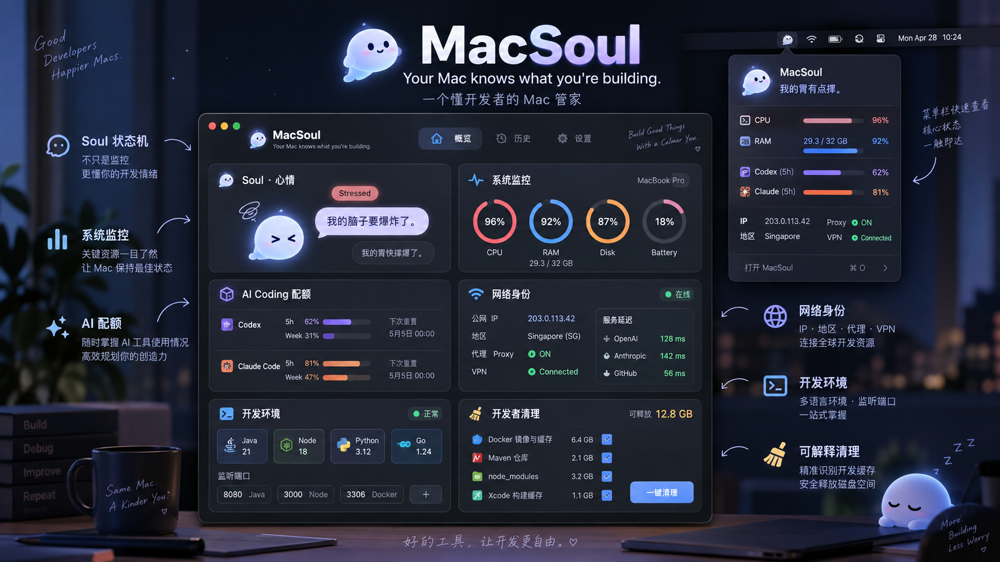

# MacSoul

**Your Mac knows what you're building.**

MacSoul 是一款原生 SwiftUI macOS 开发者伴侣，计划在主窗口和菜单栏汇集系统状态、网络线索、开发环境及 AI Coding 配额，并用 Soul 角色表达需要关注的状态。配额只显示账户实际提供的 5h / Week 窗口及其已用量、重置时间和数据新鲜度。



> 产品概念图，**不是当前 App 截图或功能验收证据**。图中的实时指标、VPN、服务延迟和清理按钮等尚未实现；当前可运行版本仅使用 Mock 数据，Cleaner 不执行删除。

## 当前阶段

仓库已有可重复构建的 macOS 工程、Mock App、测试入口与任务账本。主窗口和 Menu Bar 共用一份演示数据；Soul 六种状态及品牌资源已接入。真实系统采样、网络探测和 AI 账户配额尚未接入。各项验收以 [`docs/STATUS.md`](docs/STATUS.md)、[`tasks.json`](tasks.json) 和当次验证报告为准；初始化包与历史审查材料不代表功能已完成。

Settings 可切换 MacSoul 自身的浅色/深色外观及简体中文/英文界面，不会修改 macOS 的全局外观。当前界面仍按人工截图逐项验收，截图中的静态呈现不代表所有交互已通过。

## 开发入口

先读 `AGENTS.md` 和由 `tasks.json` 生成的 `docs/STATUS.md`；继续开发时读 `prompts/CONTINUE.md`。原首次导入说明保存在 `docs/archive/bootstrap/START-HERE.md`，不再作为当前任务入口。本机需安装 Xcode；工程最低部署目标为 macOS 13，当前实测环境见 `reports/phase-a-visual-closeout-2026-09-28.md`。

```sh
./scripts/doctor.sh
./scripts/verify.sh
./scripts/run-mock.sh
```

`./scripts/verify.sh` 运行 doctor、Debug build、XCTest 和任务账本检查；日志、测试结果及验证摘要写入被 Git 忽略的 `.artifacts/`。首次克隆或源码变更后都需重新运行。可用 `open MacSoul.xcodeproj` 在 Xcode 中查看工程。
`./scripts/run-mock.sh` 需先退出正在运行的 MacSoul，再构建并从被 Git 忽略的可见 `build-preview/` 目录打开 Mock App；直接从隐藏的 `.artifacts/DerivedData` 启动可能让 macOS 在 Dock 显示通用图标。

## 当前实现

仓库包含 `MacSoul.xcodeproj`、共享 scheme、App 和 XCTest target。主窗口与 Menu Bar 使用同一份 Mock Snapshot；Codex 和 Claude Code 支持 5h 与 Week，按实际适用窗口动态展示已用比例和可用的重置时间。当前没有真实系统采样、网络或 AI 配额接入。Mock、未报告、请求失败及过期状态应明确显示，不能当作实时数据。

Phase A 的本机 build/unit 曾通过；界面仍在按实际截图修正，性能和真实 Provider 检查为 NOT_RUN。当前进度以 `docs/STATUS.md` 和 `tasks.json` 为准，既有报告记录其生成时的证据。

## 文件导航

| 路径 | 用途 |
|---|---|
| `docs/archive/bootstrap/START-HERE.md` | 原首次导入说明，仅作历史参考 |
| `AGENTS.md` / `CLAUDE.md` | 共用工作规则与 Claude 导入入口 |
| `docs/PRD.md` / `docs/SCOPE.md` / `docs/DESIGN.md` | 产品概述、范围、界面契约 |
| `docs/ARCHITECTURE.md` / 专题文档 | 共享 Snapshot、Soul、网络与配额设计 |
| `docs/7-DAY-PLAN.md` | 原七天基线；已迁移到 `tasks.json`，不自动重置进度 |
| `docs/PROGRESS-PROTOCOL.md` / `docs/STATUS.md` | 证据驱动汇报、追赶机制和当前状态 |
| `MacSoul/` / `MacSoulTests/` / `MacSoul.xcodeproj` | App 源码、XCTest 与 Xcode 工程 |
| `prompts/` | 当前继续、未完成 Phase A、审查与追赶任务 |
| `review/` | 审查与验收材料；历史结论不等于当前验证 |
| `templates/` | 原模型配置，仅作参考，不会在本包中自动启用 |
| `reference/` | 历史原文与概念效果图，不覆盖当前规范 |
| `scripts/verify.sh` | 本机 build、unit 和账本的固定验证入口 |
| `scripts/check_bundle.py` | 历史包检查；原路径已归档，缺失或改动仍如实报告 |
| `docs/archive/bootstrap/` | 原清单、包校验、首次导入与旧 Day 1 入口 |

## 产品边界

Menu Bar + 主窗口；System、Network、Dev、Codex/Claude 动态展示适用的 **5h / Week** 配额、本地 Soul。菜单栏与 Overview 展示同一份 CPU、内存、磁盘和电池 Mock 指标。
AI 模块不做 Token、成本或 Agent Session。Cleaner 当前只允许只读扫描设计，Notch 不进入首次加固。
所有数字是演示数据，直到真实 provider 接入并验收。概念图不是已实现功能或安全保证。

## 验证状态

查看 [`reports/phase-a-visual-closeout-2026-09-28.md`](reports/phase-a-visual-closeout-2026-09-28.md) 中的当前 UI 修订与验收限制，以及本机 `.artifacts/verification.json` 中的实际命令和退出码。`reports/phase-a.md` 是历史证据，源码或工具链变化后须重跑。[`BUNDLE-CHECKS.json`](docs/archive/bootstrap/BUNDLE-CHECKS.json) 仅记录最初合并包的校验，不是 App 验收结果。

初始化材料的归档路径、忽略范围和干净克隆验证见 [`reports/repository-hygiene-2026-09-28.md`](reports/repository-hygiene-2026-09-28.md)。

[GitHub Actions](https://github.com/liu-657667/macsoul/actions) 在每次推送和 pull request 上运行相同的 `./scripts/verify.sh`；远端结果以对应提交的工作流运行记录为准。

## License

MacSoul 有权授权的自有代码采用 [MIT License](LICENSE)，版权声明为 `Copyright (c) 2026 liu-657667`。Cleaner 扫把图标来自 Phosphor Icons，原始版权与 MIT 许可全文随 App 收录于 [ThirdPartyNotices.txt](MacSoul/Resources/ThirdPartyNotices.txt)。其他第三方代码、依赖和素材保留各自的许可证、版权归属及必要声明，不因本项目采用 MIT 而被重新授权。`reference/` 中的历史输入和概念素材也不因根目录的 `LICENSE` 自动获得新的授权。
